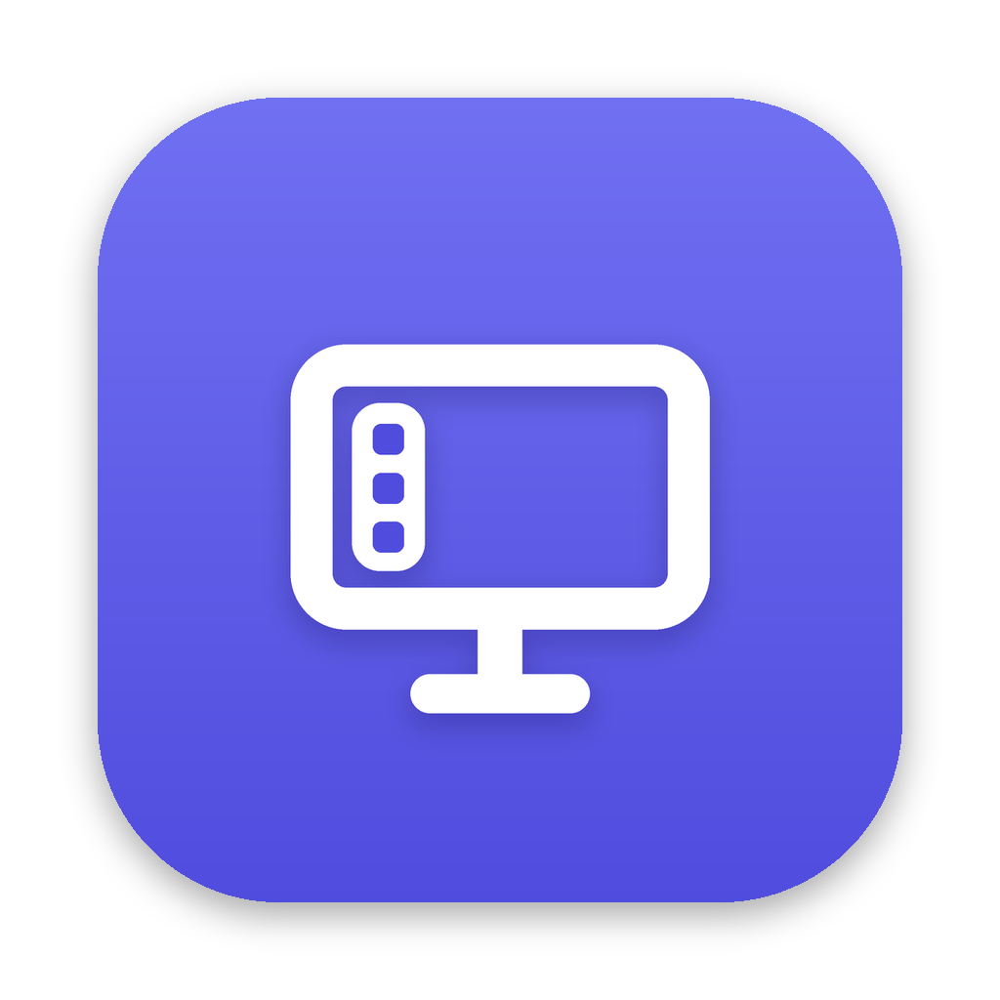
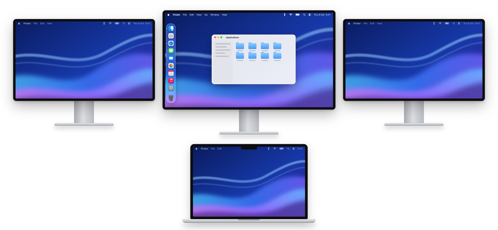

# DockPin

Keeps the macOS Dock on your center monitor.

<a href="https://github.com/iosifnicolae2/DockPin/releases/latest/download/DockPin.zip"></a>



With several monitors, macOS moves the Dock to whichever screen the pointer lingers at the edge of.
DockPin keeps it on the monitor in the middle, on its left, bottom or right edge, through sleep,
display changes and every login. It lives in the menu bar.

## Install

1. [Download DockPin.zip](https://github.com/iosifnicolae2/DockPin/releases/latest/download/DockPin.zip),
   unzip it and move `DockPin.app` to Applications. It needs macOS 14 or later.
2. Open it. Its icon appears in the menu bar, and it opens at login from then on.
3. Allow Accessibility when macOS asks (System Settings > Privacy & Security > Accessibility).
   DockPin only watches pointer movement; it never reads keystrokes, windows or the screen.

From its menu you pick the monitor (the center one by default) and the Dock's position.
Quit it to put your display arrangement back as it was.

All versions: [Releases](https://github.com/iosifnicolae2/DockPin/releases).

## Build from source

```sh
swift test                        # run the tests
scripts/build-app.sh --install    # build DockPin.app into ~/Applications and start it
```

[How it works](docs/how-it-works.md) explains the approach, the permission and the trade-offs.
[Development](docs/development.md) covers the test tools, diagnostics and releases.
